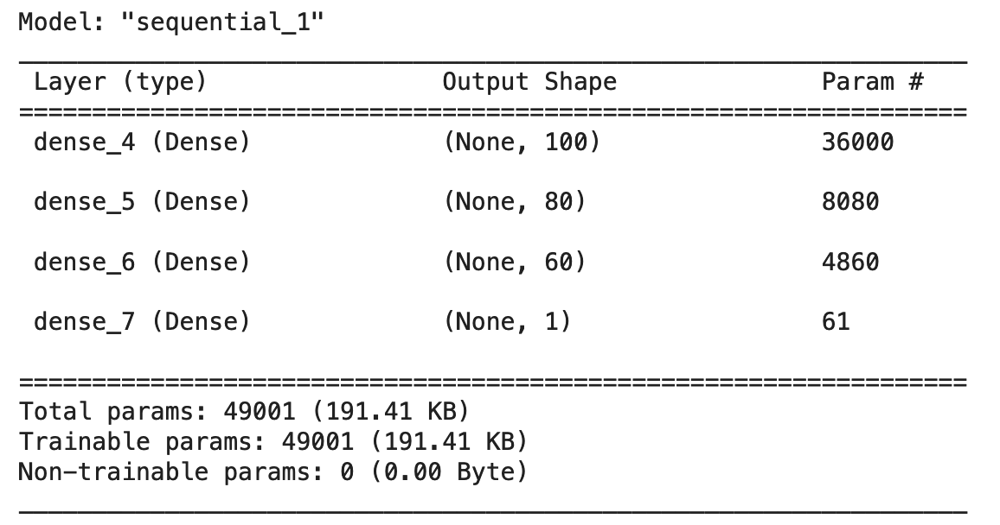
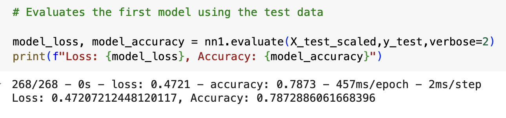

# Deep Learning Model Report

## Overview 

Alphabet Soup, a nonprofit organization, wants a Machine Learning model which will recommend applicants to provide funding to which will provide good chances of being successful. The model constructed in this project looks at data containing 12 unique columns to try and accurately predict the success of various applicants. 

## Results 

**Data Preprocessing** 

* The variable for the target in this model is the column called 'IS_SUCCESSFUL' in the application_df DataFrame. 

* The variables for the features in this model are the columns: 'NAME', 'APPLICATION_TYPE', 'AFFILIATION', 'CLASSIFICATION', 'USE_CASE', 'ORGANIZATION', 'STATUS', 'INCOME_AMT', 'SPECIAL_CONSIDERATIONS', and 'ASK_AMT'. 

* The only variable that should be removed from the input data because it is not used by the model is the column 'EIN'. 

**Compiling, Training, and Evaluating the Model**

* This model contains three layers and an output layer. The first layer has 100 neurons, 359 dimensions of features in the input, and a relu activation function. The second layer has 80 neurons and a sigmoid activation function. The third layer has 60 neurons and a sigmoid activation function. The output layer has a single neuron and a sigmoid activation function. The original model only had two layers with 80 and 30 neurons, respectively. The accuracy of the model was not very high, so another layer and more neurons were added to see if the model would be able to learn from the training data better. Instead of the relu activation function used in all the hidden layers, the sigmoid activation function is used to see if this better represents the data since this is a classification problem.  

* The target model performance was set to be 75%. The accuracy of the optimized model on the test data ended up being 78%, which means the model was able to exceed the target model performance. 

* The strategy to increase model performance was to adjust one parameter at a time. Firstly, instead of removing two variables from the features, only the 'EIN' column was removed. The number of epochs was increased from 100 to 125 to give the model more attempts to adjust the weights. Then, the neurons of only the first layer was increased. It was set from the original 80 neurons to 100 neurons. After this, the neurons in the second layer were increased from 30 neurons to 80 neurons. Next, a third hidden layer was added with 60 neurons. After all of this, the activation functions of the hidden layers were changed from relu to sigmoid.   

**Summary** 

When given an applicant with 10 specific feature values('NAME', 'APPLICATION_TYPE', 'AFFILIATION', 'CLASSIFICATION', 'USE_CASE', 'ORGANIZATION', 'STATUS', 'INCOME_AMT', 'SPECIAL_CONSIDERATIONS', 'ASK_AMT'), this model is able to predict whether or not this respective applicant will be successful to a 78% accuracy. While a Deep Learning Model does a decent job at predicting the success of an applicant, there are other machine learning models that can as well. One possible recommendation is to use Random Forest. This Machine Learning technique will randomly select a subset of data and a random subset of features within that data to train onto with decision trees. This technique leads to an increase in the overall accuracy and may even have a higher accuracy than the Deep Learning Model.  
 

